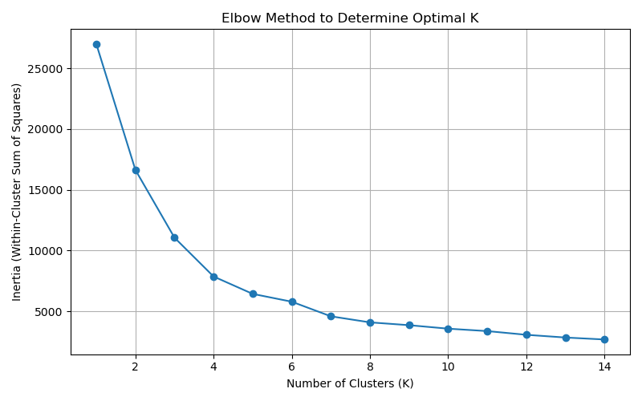
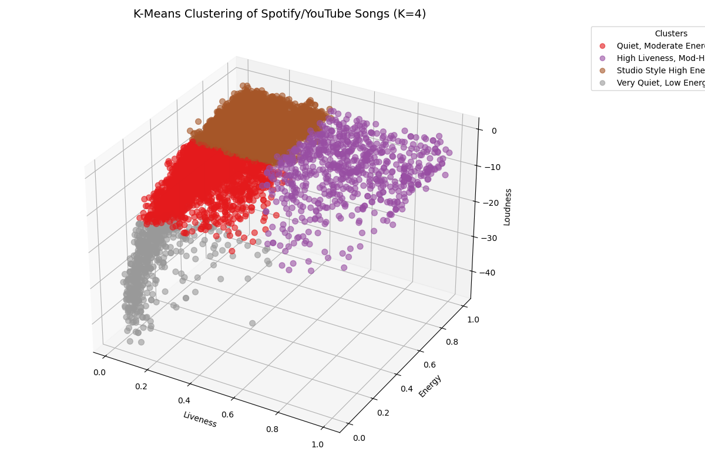
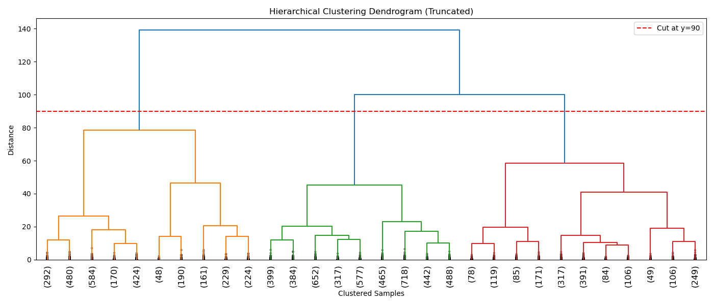
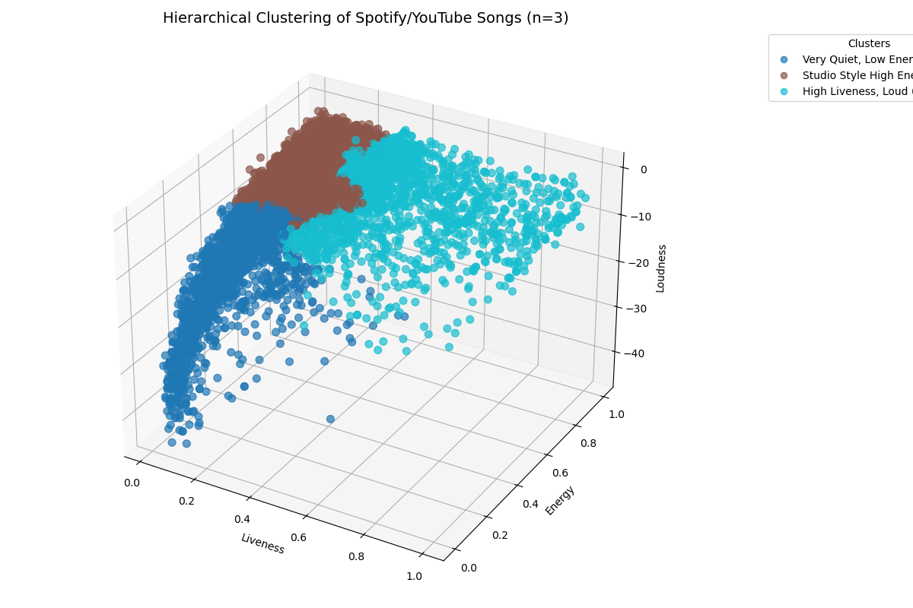

# HW7
Take the code that was written in class for K-means and make it work for a 3D data sets. Using the Spotify_ YouTube.csv data set, read in the following three columns: Liveness, Energy, Loudness. Using an elbow graph, find the optimal number of K and use that to visualize the data and groups based on that K. Graphs should be appropriately labeled with an x, y, and z axis along with a title and legend. Then write what your results might mean to you.

Then, take each of the individual columns and run hierarchical clustering on them. Are there any? distinct groups. If so, how would you define each group? Graphs should be appropriately labeled. Then write what your results might mean to you.

Grading (Out of 100 points)
• 70 points: Cover what you did to update the code to work for 3D data and visualization along with what number of K you found to be optimal and the graphs showing the results of running K-means and what your results mean.
• 30 points: Report your findings for running Hierarchical clustering.

How to turn in
Turn in the final report and code that you wrote to Githbub

# Clustering Analysis Report: Spotify_YouTube Dataset

## Dataset & Features
We used the `Spotify_YouTube.csv` dataset and focused on the following three numerical audio features:
- **Liveness**: Indicates the presence of an audience.
- **Energy**: A perceptual measure of intensity and activity.
- **Loudness**: Overall loudness of a track in decibels.

---

## Code Updates: Preparing for 3D Clustering

The code was updated to:
- Read the three selected features: `Liveness`, `Energy`, and `Loudness`.
- Apply **StandardScaler** for normalization.
- Perform **K-Means clustering** and **Hierarchical clustering**.
- Create **3D visualizations** using `matplotlib` with labeled axes and color-coded clusters.

---

## Optimal Number of Clusters (K) for K-Means

To determine the optimal number of clusters for K-Means, we used the **Elbow Method**:

- The elbow point was observed at **K = 4**, where the rate of inertia reduction flattens.
- We selected **K = 4** for K-Means clustering accordingly.

---

## K-Means Clustering Results (K=4)

We ran K-Means with 4 clusters and visualized the results in 3D:

### K-Means Cluster Centers (Original Scale)

| Cluster | Liveness | Energy | Loudness | Interpretation |
|--------:|----------|--------|----------|----------------|
| 0 | 0.146 | 0.449 | -10.57 | Quiet, Moderate Energy |
| 1 | 0.677 | 0.706 | -7.43 | High Liveness, Mod-High Energy |
| 2 | 0.164 | 0.780 | -5.81 | Studio Style High Energy |
| 3 | 0.131 | 0.105 | -23.70 | Very Quiet, Low Energy |

### Interpretation:
- K-Means successfully grouped the songs into **four distinct clusters**.
- These clusters distinguish between ambient/quiet music, studio tracks, energetic live tracks, and moderate-pop content.
- The results can support **music recommendation**, **playlist design**, and **genre detection**.

---

## Hierarchical Clustering Results (n=3)

We also applied **Hierarchical Clustering** using Ward's linkage method.
To determine the number of clusters, we cut the dendrogram at a distance of **90**, which resulted in **3 clusters**.

### Dendrogram:

### 3D Hierarchical Clustering Visualization:

### Hierarchical Cluster Centers (Original Scale)

| Cluster | Liveness | Energy | Loudness | Interpretation |
|--------:|----------|--------|----------|----------------|
| 1 | 0.130 | 0.354 | -14.15 | Very Quiet, Low Energy |
| 2 | 0.129 | 0.740 | -6.01 | Studio Style High Energy |
| 3 | 0.477 | 0.728 | -7.08 | High Liveness, Loud (Live Feel) |

### Interpretation:
- Hierarchical clustering revealed **3 major groups** in the dataset.
- The clusters align with general musical energy and liveness levels.
- Useful for creating **high-level grouping or mood categorization**.

---

## Final Thoughts

- Both K-Means (K=4) and Hierarchical Clustering (n=3) identified meaningful and interpretable clusters.
- K-Means offers more granularity, while hierarchical clustering shows broader structure.
- The three features—`Liveness`, `Energy`, `Loudness`—are effective for clustering songs based on audio characteristics.
- These findings can assist in:
  - **Music discovery tools**
  - **Context-aware playlists**
  - **Live vs studio classification**

---

## Output Files

| File | Description |
|------|-------------|
| `Elbow_Method.png` | Elbow method plot for optimal K |
| `KMeans_3D_Clusters.png` | K-Means clustering (K=4) result |
| `Hierarchical_Dendrogram.png` | Truncated dendrogram with cut line |
| `Hierarchical_3D_Clusters.png` | Hierarchical clustering (n=3) result |
